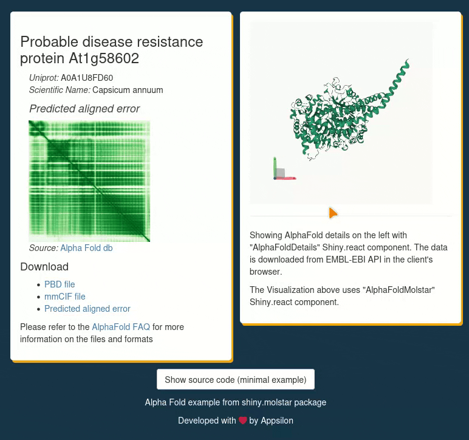

# shiny.molstar <a href="https://appsilon.github.io/shiny.molstar/"></a>

> _R Shiny wrapper for Mol* (/'molstar/) - A visualization toolkit of large-scale molecular data_

<!-- badges: start -->
[](https://github.com/Appsilon/shiny.molstar/actions/workflows/ci.yml)
<!-- badges: end -->

Based on [Mol*](https://molstar.org) (/'molstar/) and powered by [shiny.react](https://appsilon.github.io/shiny.react/)

We created a R Shiny wrapper based on [shiny.react](https://appsilon.github.io/shiny.react/) and [molstar-react](https://www.npmjs.com/package/molstar-react) _(node.js library)_ that gives all the powerful tools of Mol* open-source toolkit for visualization and analysis of large-scale molecular data.

This package exports three new components that can be used in a Shiny application.

* `Molstar` creates a Molstar visualization of a protein using an URL to a valid filetype supported by Molstar or a "Protein Data Bank" id _(pdbId)_. See more below for available databases to find a valid `pdbId`.
* `AlphaFoldMolstar` similar to the Molstar component, but uses the UniProt id in the AlphaFold database to display the protein.
* `AlphaFoldDetails` creates a component that retrieves details of an AlphaFold protein id _(title, download links and a Predict Aligned Error image)_

### How to find a valid id or url?

A valid `pdbId` can be found in public databases such as:

* [EMBL-EBI database](https://www.ebi.ac.uk/pdbe/entry/search/index/)
* [RSCB.org](https://www.rcsb.org/)

The `uniProtId` can be found in any of the AlphaFold databases:

* [AlphaFold.com](https://alphafold.com/)

## Getting started

To install the package, run:

```{R}
remotes::install_github("Appsilon/shiny.molstar")
```

Take a look at basic [example app](https://github.com/Appsilon/shiny.molstar/blob/main/inst/examples/Minimal.R) to start working with shiny.molstar.

To learn about the Mol* language, follow the [Viewer documentation](https://molstar.org/viewer-docs/).

## Examples

A good way to learn more is to look at the examples. Once you install the library, you can run them with `shiny.molstar::runExample` function.

```{R}
shiny.molstar::runExample("FullPage")
shiny.molstar::runExample("Minimal")
shiny.molstar::runExample("AlphaFold")
shiny.molstar::runExample("AlphaFoldDetails")
```

### Full page example

Creating a full page viewer on a sample molecule _(example also available at `inst/examples/FullPage.R`)_

```{R}
library(shiny)
library(shiny.molstar)

shinyApp(
  ui = tagList(
    tags$style(HTML("html, body { margin: 0; }")),
    Molstar(
      pdbId = "1LOL",
      useInterface = TRUE,
      showControls = TRUE,
      showAxis = TRUE
    )
  ),
  server = function(input, output) {
  }
)
```


### Using AlphaFold database and details

Running an example from the package _(located at `inst/examples/AlphaFoldDetails.R`)_.

You can click on the button on the bottom of the example to get the minimal code to reproduce the same Shiny application _(unstyled and without the footer)_.

```{R}
shiny.molstar::runExample("AlphaFoldDetails")
```



## Appsilon


Appsilon is a **Posit (formerly RStudio) Full Service Certified Partner**.<br/>
Learn more
at [appsilon.com](https://appsilon.com).

Get in touch [opensource@appsilon.com](mailto:opensource@appsilon.com)

Check our [Open Source tools](https://shiny.tools).

<a href = "https://appsilon.com/careers/" target="_blank"></a>
